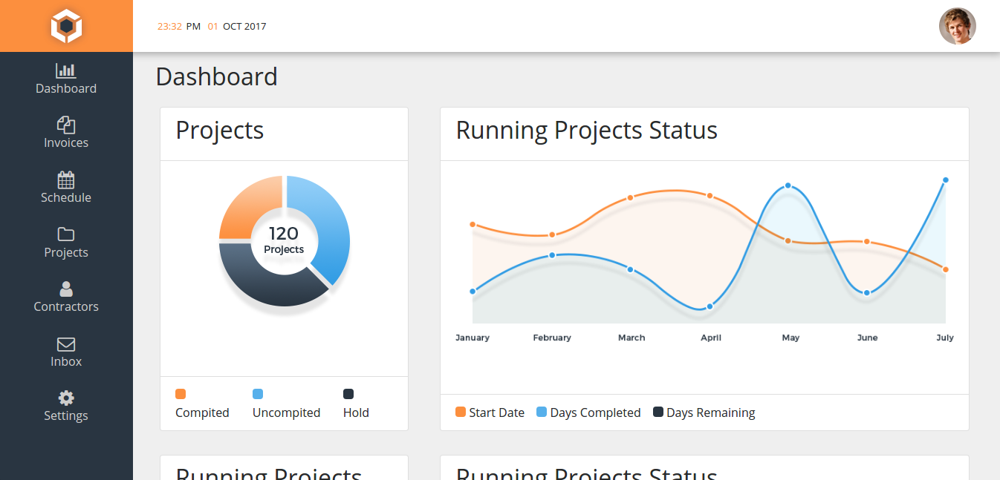

[](https://david-dm.org/thiagopaiva99/admin-theme?type=dev) [](https://david-dm.org/thiagopaiva99/admin-theme)

# Admin Theme

An free admin panel that its been developed and everyone can contrib.



## In this version we have:
- HTML + CSS (SCSS) + JS;
- Bootstrap 4;
- Gulp;
- Bower;
- Browser Sync;
- Responsive design;
- Nice layout;

## How can you download and use it?

Its very simple to download and use the admin-theme, just follow these steps

```
  $ git clone https://github.com/thiagopaiva99/admin-theme.git admin-theme
  $ cd admin-theme
  $ npm install
  $ bower install ( if you dont have bower as a global package, first run npm install -g bower )
  $ gulp ( if you dont have gulp as a golbal package, first run npm install -g gulp )

  Now is just code!!!
```

We hope to release more versions of this theme in the future, in Angular, React, Vue, etc ...

### How can you help us?
- Star our GitHub repo
- Create pull requests, submit bugs, suggest new features or documentation updates

## License

This project has an MIT license, because we <3 open source.
